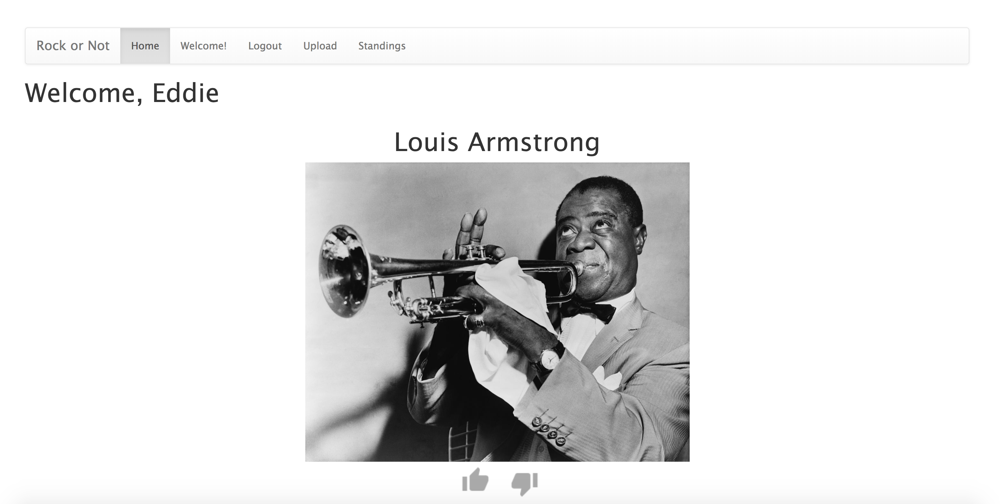
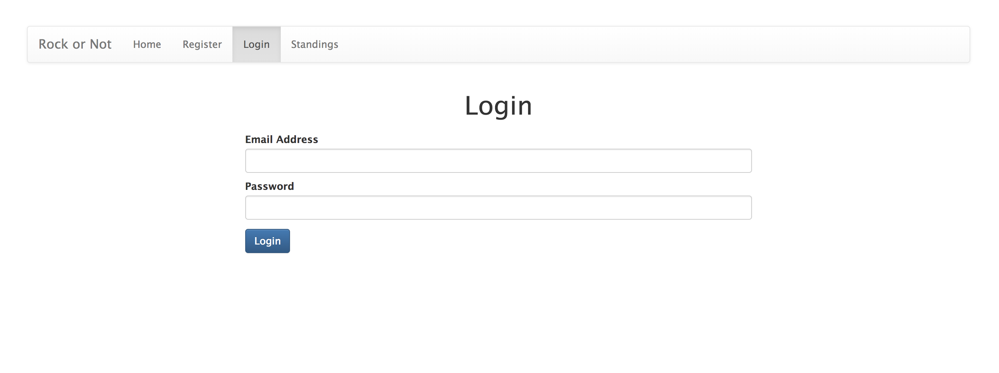

## Rock or Not
Rock or Not allows users to login and vote on various musical groups. It also allows users to upload images of bands to be included in future votes.

## Github Link:
[Rock or Not GitHub](https://github.com/eddieatkinson/voteApp)

## Technologies used:
**Languages:**
* Node
* JavaScript
* HTML5
* CSS

**Frameworks:**
* Express
* jQuery
* Bootstrap

**Other:**
* MySQL

## Code snippets:
Only display bands the user has not voted on using a promise to handle asynchrony when querying the database:
``` javascript
router.get('/', function(req, res, next) {
    var message = req.query.msg;
    if(req.session.name == undefined){
        res.redirect('/login?msg=mustlogin');
        // console.log(`Welcome, ${req.session.name}`);
    }
    // Make a promise to handle JS asynchrony
    const getBands = new Promise((resolve, reject)=>{
        // Only get bands user has not voted on
        var selectSpecificBands = `
            SELECT * FROM bands WHERE id NOT IN(
                SELECT imageID FROM votes WHERE userID = ?
            );
        `;
        connection.query(selectSpecificBands, [req.session.uid], (error, results)=>{
            if(error){
                reject(error)
            }else{
                if(results.length == 0){
                    // user has voted for everyone
                    resolve("done");
                }else{
                    var rand = Math.floor(Math.random() * results.length);
                    resolve(results[rand]);
                }
            }
        });
    });

    getBands.then((bandObj)=>{
        if(bandObj == 'done'){
            // out of bands
            res.redirect('/standings?msg=complete');
        }else{
            res.render('index', {
                name: req.session.name,
                band: bandObj,
                message: message,
                loggedIn: true
            });
        }
    });
});
```
Login:
``` javascript
router.post('/loginProcess', (req, res, next)=>{
    // res.json(req.body);
    var email = req.body.email;
    var password = req.body.password;

    var selectQuery = `SELECT * FROM users WHERE email = ?;`;
    connection.query(selectQuery, [email], (error, results)=>{
        if(error){
            throw error;
        }else{
            if(results.length == 0){
                // not in DB, so we don't care about the password
                res.redirect('/register?msg=badUser');
            }else{
                // our selectQuery found something! check the password with compareSync...
                var passwordsMatch = bcrypt.compareSync(password, results[0].password);
                if(passwordsMatch){
                    // user in DB, password is legit, log them in...
                    var row = results[0];
                    req.session.name = row.name;
                    req.session.uid = row.id;
                    req.session.email = row.email;
                    res.redirect('/');
                }else{
                    // user in DB, but bad password, send back to login
                    res.redirect('/login?msg=badPass');
                }
            }
        }
    });
});
```

## Screenshots:




